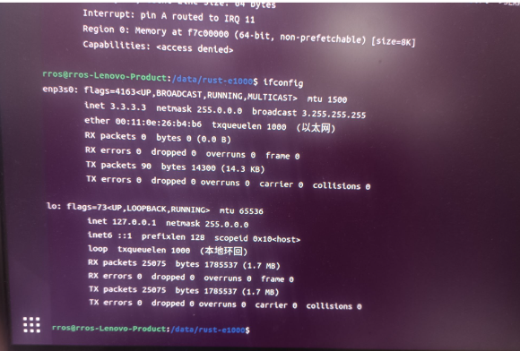
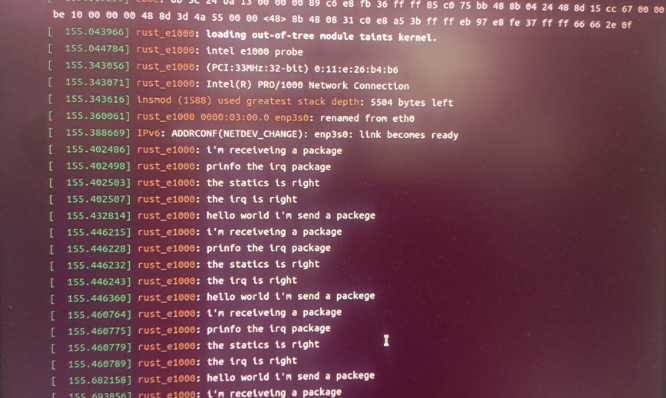
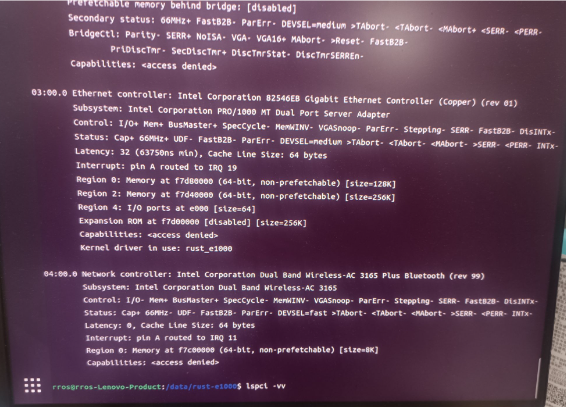
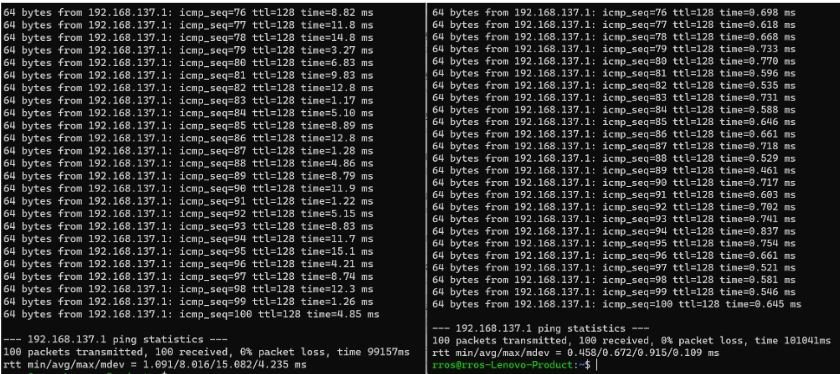

# Introduction

Run `./draw.sh` to generate `figure8.pdf` that corresponding to `Figure 8: The latencies between Rust and C drivers.`.

We have provided some data files in `data` directory. They show the seconds used after 1000,000 ping between binder client and binder server.

## e1000

We use two machines to ping each other. We test 100 times ping and record the average latency, the maximum latency and the minimum latency.

If you want to test the latency by your self, you should do these things:
1. compile linux with C e1000, compile it as module.
2. `make modules_install` and `make install`, after that reboot and boot with the new kernel
3. Use `insmod` or `modprobe` to load e1000 driver. Use `ifconfig` or `ip` tools to set up the nic ip address.
4. do these things in other machine, then ping each other within same net area.

There are some pictures that show the test about e1000:

**e1000_ifconfig**:


**e1000_running**:


**lspci_e1000**:


**ping latency, left is Rust and right is C**:


> rust e1000 needs to modify code and use the right.
> Please see the following links: 
> 1) Modify the code: https://github.com/fujita/rust-e1000/pull/9 https://github.com/fujita/rust-e1000/pull/4
> 2) Configure tap device: https://github.com/fujita/rust-e1000/pull/7/files
> 3) arp set manually https://github.com/fujita/rust-e1000/issues/5#issuecomment-1620161851
> Note: Rust e1000 driver still has bugs, it will break if you try to run perf. Please don't do this.
> If you want to test e1000 in our mechine, just ssh to our machine[the related info in listed in the AE system] and tell us you need to run e1000 in issus. Because we only have one NIC, you need to run a qemu to ping each other. We did the experiment in the real machine, Thus, the data may differs sightly.


## binder

If you want to test the latency of C binder and Rust binder, just ssh to our machine. Note that C binder and rust binder can not live in one kernel together. If you want to test a different binder, you should compile linux with a different config and reboot a new kernel.

In our machine, the directory `/data/linux/` have the `rust-binder-rfc` and `binder-rfc` branch. In `rust-binder-rfc` branch, there is only a rust binder, you can not find C binder in Kconfig. In `binder-rfc` branch, both C and Rust binder can be build. Assume you use `binder-rfc` branch to test Rust binder, you can just do these things:
1. Make sure current kernel have already build rust binder. You can check it by 
    - `cat /proc/devices` see the if there is a `rust_binder` instead of `binder` in character devices group
    
    or

    - `less /boot/config-$(uname -r)` (or read this file through the way whatever you want), check if `CONFIG_ANDROID_BINDER_DEVICES_RUST` and `CONFIG_ANDROID_BINDERFS_RUST` are set and `CONFIG_ANDROID_BINDER_IPC` is not set.
2. run these commands

    ```bash
    mkdir /dev/binderfs
    mount -t binder binder /dev/binderfs
    cd /data/linux/tools/testing/selftests/binder
    touch server.log client.log
    ./ping_server /dev/binderfs/binder >> server.log &
    ./ping_client /dev/binderfs/binder >> client.log &

    # wait for sometime you will receive the process ping_client is done
    # and the client.log store the total time cost after 1000,000 times ping
    ```

3. Change kernel config to open C Binder and build kernel, boot the new kernel. Then do things above again to test C Binder.
